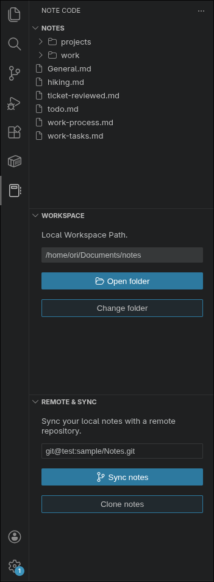
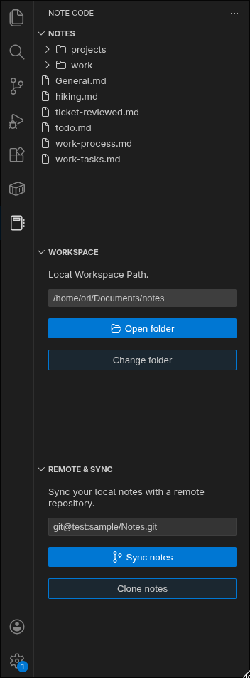

# 📝 Note Code

A simple **Markdown** note taking extension for Vs Code - Create, Manage, sync notes with **Git**, and **Obisidian** Compatible.

---

## ✨ Features

- 🗒️ **Create Notes** — Instantly create Markdown notes within VS Code.
- 🔄 **Sync Notes** — Push and pull notes from **GitHub** or any Git repository.
- 🧩 **Git Ready** — Native Git support for versioning and collaboration.
- 📂 **Obsidian-Compatible** — Works seamlessly with existing Obsidian note directories.
    > ⚠️ _Note:_ Custom Obsidian features (e.g., plugins or syntax) are not currently supported.

---

## ⚡️ Motivation

> Many note-taking extensions are currently available, but most are overwhelming and difficult to use "out of the box." Note code is built for developers who want a "plug-and-play" experience with batteries included—automating the process of cloning, updating, and syncing notes with your repositories.

---

## 🖼️️ Preview

| Dark 2026                                                   | Dark Modern                                                   |
| ----------------------------------------------------------- | ------------------------------------------------------------- |
|  |  |

---

## ⚙️ Configuration

Add your preferred note directory and repository link in **VS Code settings**:

```json
"notecode.noteDir": "/home/user/Documents/notes",
"notecode.repoLink": "https://github.com/note-code-extension/note-code"
```

## 🚀 Quick Setup

A fast, predictable onboarding flow. Each step tells you **what to do** and **what the extension does for you**.

---

### 1) Set Your Local Workspace

> Choose where your notes live on your computer.

**Do this**

- Click **Select Folder**
- Pick a directory (e.g. `~/Documents/notes`)

**Tips**

- Use an **empty folder** for a clean start

**What happens behind the scenes**

- The extension prepares the folder as a Git workspace (if it isn’t already)

---

### 2) Create Your Remote Vault

> Create a repository on GitHub or GitLab to store your notes in the cloud.

**Do this**

- Create a **new repository**
- Set it to **Private** (recommended for personal notes)

**Important**

- **Do NOT** initialize with a README, License, or .gitignore if you already have local notes
- Keep the repo **empty**

**Why**

- This prevents merge conflicts during the first sync

---

### 3) Link & Clone

> Connect your local folder to your remote repository.

**Do this**

- Paste your repo URL into the input field  
  `https://github.com/username/my-notes.git`

**What happens behind the scenes**

- If the folder is empty → the extension runs `git clone`

No manual Git commands needed.

---

### 4) Stay in Sync

> Keep your notes backed up and available across devices.

**Your workflow**

- Edit or create notes
- Click **Sync**

**What happens behind the scenes**

- The extension pulls remote changes
- Commits your local changes
- Pushes everything safely to the remote

Your notes are now versioned, backed up, and accessible anywhere.

## 🧭 Commands & Actions

| Command                                      | Description                                                          |
| -------------------------------------------- | -------------------------------------------------------------------- |
| **Change Folder Path / Select Notes Folder** | Choose or update the folder where notes are saved and read.          |
| **Clone Notes**                              | Pull the latest changes from the remote repository.                  |
| **Sync Notes**                               | Commit and push all note changes to the connected remote repository. |
| **Create Note**                              | Instantly create a new Markdown note in the selected directory.      |

## ❤️ Contributing

Contributions to this project are highly encouraged! A detailed contribution guide will be added soon. You can run the project using VS Code’s Run and Debug feature or simply press F5.
